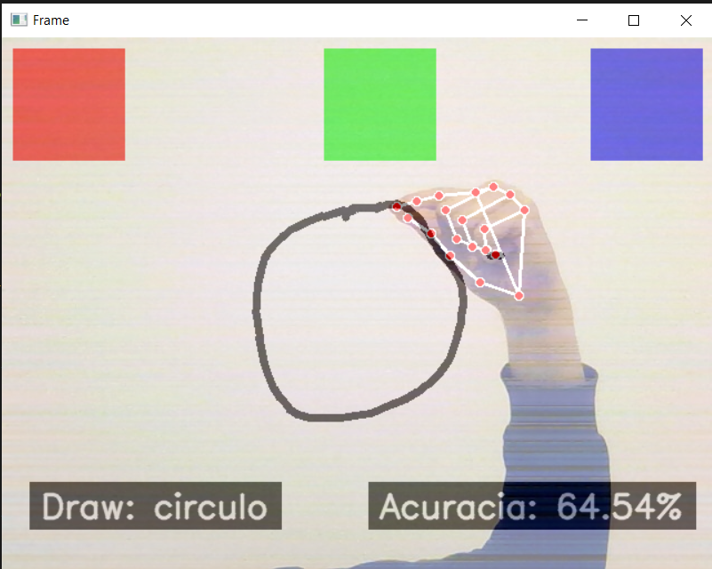

# Geometric Draw

`PPC-CC: PUC Poços de Caldas - Ciência da Computação`
`Disciplina: Visão Computacional e Realidade Aumentada`
`2024 - Semestre 1`

## Integrantes

- Lucas de Godoi Moraes

## Professor

- Will Ricardo dos Santos Machado

# Documentação

<ol>
<li><a href="docs/Apresentação do Projeto.md">Slides do Projeto Geometric Draw</a></li>
</ol>

# Código

<li><a href="src"> Código Fonte</a></li>

# Apresentação

<li><a href="https://youtu.be/8yNVKXqloZc">Apresentação da solução</a></li>
